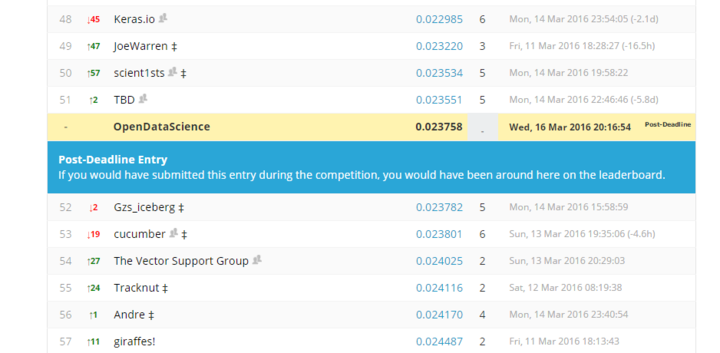
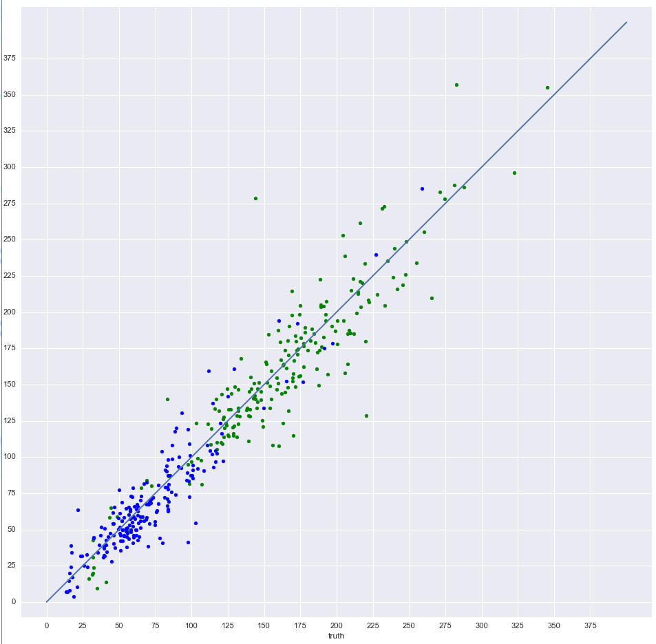
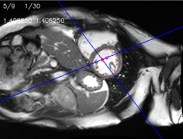
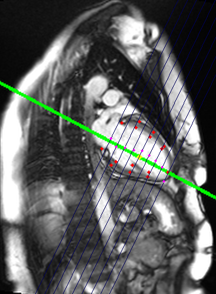
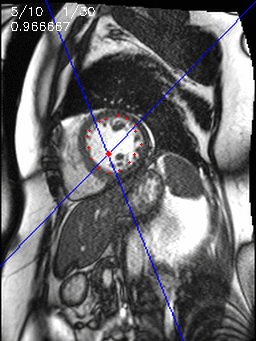
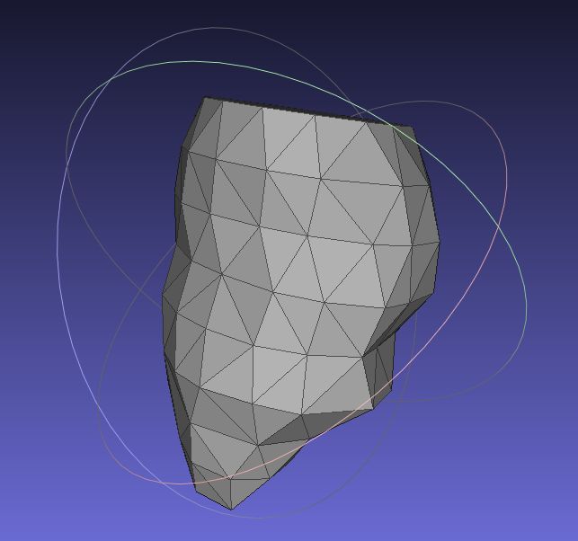

#  Second Annual Data Science Bowl solution #

Due to organizational mistakes in second phase our team was hihgly overfitted and finished on 168th place.

Without making such mistake we were chances to place near to the 50th position.

Here is plot of our predictions vs. groundtruth on validation subset.

## Main contributions ##

We developed 2d landmark detection for SAX and 2CH left ventricle projections. Landmarks drawn with red.

Here is an animation of landmark tracking on SAX view.

Also we made some experiments on 3D reconstruction using MeshLab software.

